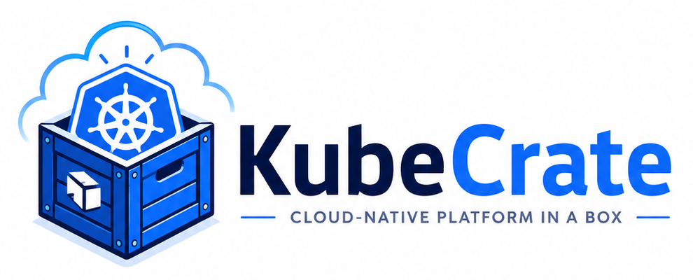

<p align="center">
  
</p>

# Kubecrate

Kubecrate is a minimal cloud-native platform in a box.

Kubecrate is an upstream distribution for GitOps-managed Kubernetes platform services. A separate consumer repository must provide the cluster-specific Flux source, binding, and private application services before Kubecrate can be installed into a cluster. The target experience is point at a cluster and install, using any conforming Kubernetes cluster.

## Project model

Kubecrate separates lifecycle phase from workload category.

Lifecycle phases:

1. **bootstrap installation**: establish the components required to start GitOps-managed operation;
2. **GitOps-managed operation**: reconcile Kubecrate resources from Git.

Workload categories:

1. **platform services**: shared capabilities that make the platform usable;
2. **application services**: workloads that run on the platform.

Bootstrap is a lifecycle or management mode, not a third workload category.

Kubecrate is opinionated by design:

- minimal over comprehensive;
- opinionated over configurable;
- open source first;
- GitOps by default;
- production-inspired, not production-ready.

## Repository structure

The repository contains reusable platform-service definitions and the Vanilla composition that combines them for GitOps-managed operation.

```text
platform-services/                         reusable platform-service bases
compositions/vanilla/                      reusable Kubecrate Vanilla composition
docs/                                      architecture, workflows, and runbooks
scripts/                                   validation helpers
requirements-dev.txt                       development dependencies
```

## Vanilla composition

`compositions/vanilla/entrypoint/` is the reusable composition path. It contains Flux resources for the included platform services:

- External-Secrets Operator,
- Envoy Gateway,
- cert-manager,
- Kyverno.

Reusable service definitions are under `platform-services/<service>/base/`. The composition-specific bindings under `compositions/vanilla/platform-services/<service>/` reference those bases and add the values and Flux wiring selected for Vanilla, such as Helm values ConfigMaps and service-specific health checks.

See [`docs/vanilla-composition.md`](docs/vanilla-composition.md) for the composition contract.

## Documentation

- [`docs/README.md`](docs/README.md) — documentation map;
- [`docs/architecture.md`](docs/architecture.md) — operating model and repository structure;
- [`docs/bootstrap-installation-contract.md`](docs/bootstrap-installation-contract.md) — bootstrap installation and GitOps handoff;
- [`docs/gitops-component-management.md`](docs/gitops-component-management.md) — management units and platform-service boundaries;
- [`docs/platform-and-application-service-model.md`](docs/platform-and-application-service-model.md) — workload categories and ownership;
- [`docs/vanilla-composition.md`](docs/vanilla-composition.md) — reusable Vanilla composition;
- [`docs/roadmap.md`](docs/roadmap.md) — project direction.

## License

Kubecrate is licensed under the MIT License. See [`LICENSE`](LICENSE).
