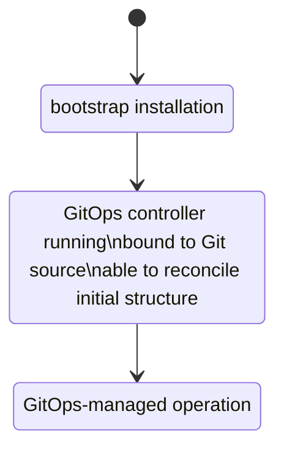

# Architecture

## Context

Kubecrate is a minimal cloud-native platform in a box.

The target experience is point at a cluster and install, using any conforming Kubernetes cluster.

## Design posture

The project follows a few practical preferences:

- minimal over comprehensive
- opinionated over configurable
- open source first
- GitOps by default
- production-inspired, not production-ready

The goal is not a platform framework. It is a small, understandable platform baseline.

## Two workload categories

Kubecrate separates workloads into two categories.

### Platform services

Platform services are shared capabilities that make the platform usable.

They are often upstream or open source components such as ingress, certificate management, secret handling components such as External-Secrets Operator, observability building blocks, or GitOps controllers.

When a platform service needs a dedicated Kubernetes namespace, Kubecrate uses the `core-<service-name>` naming rule. For External-Secrets Operator, the namespace is `core-external-secrets-operator`.

When a backing secret store is involved, the trust material for that store is operator-supplied.

### Application services

Application services are the user or company workloads that consume the platform.

They are the workloads people want to run once the shared capabilities exist.

## Bootstrap is a lifecycle mode

Bootstrap is not a separate workload category.

Some bootstrap components have to be installed before GitOps-managed operation exists. That is a lifecycle constraint, not a different class of service.

This handoff is the main reason to keep the lifecycle axis separate from the workload category axis.

Once GitOps-managed operation is available, platform services and application services should be reconciled through GitOps unless a later proposal explicitly documents why a bootstrap-managed exception is still necessary.

This keeps the long-term handling of platform services and application services aligned and reduces special-case operational paths.

## Two axes to preserve

Repository docs, proposals, and tasks should keep two axes visible:

1. lifecycle phase
   - bootstrap installation
   - GitOps-managed operation
2. workload category
   - platform services
   - application services

If those axes blur, the project becomes harder to reason about.

## Repository layout implication

Repository layout decisions should preserve the same two-axis model.

Planning artifacts live under `docs/` until an installable slice requires runtime files. Runtime directories should be introduced only by proposals that need concrete files, not as empty skeleton structure.

Real platform services use `platform-services/<service>/base/` for the reusable service definition. Cluster-specific bindings belong in the consuming distribution. Temporary cluster-local platform service implementations are forbidden unless a scoped change explicitly allows them with a removal plan.

Environment-specific structure is deferred until a scoped change requires it.
