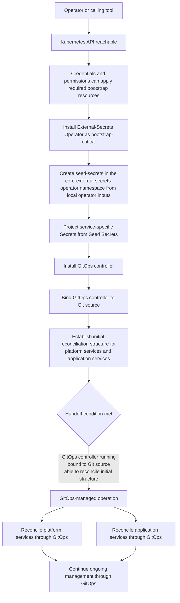

# Bootstrap installation contract

This document defines the contract for Kubecrate bootstrap installation. It explains what `point at a cluster and install` means from the operator point of view and where bootstrap installation hands off to GitOps-managed operation.

## Point at a cluster and install

`point at a cluster and install` is the target operator experience. The operator or a calling tool provides access to a Kubernetes cluster, and Kubecrate establishes the components required to start GitOps-managed operation.

The contract preserves the two-axis model:

- **lifecycle phase**: bootstrap installation or GitOps-managed operation
- **workload category**: platform services or application services

Bootstrap installation is a lifecycle phase, not a third workload category.

## Bootstrap installation start boundary

Bootstrap installation starts after:

- a Kubernetes API is reachable,
- the operator or calling tool has credentials and permissions to create or update the resources required for bootstrap installation, and
- any pre-existing resources that bootstrap installation will own do not conflict with those bootstrap-owned resources.

Bootstrap installation does not require a fresh or new cluster by default. It can start on any cluster that meets these prerequisites.

Cluster creation is outside the bootstrap installation boundary.

## Bootstrap installation completion and GitOps handoff

Bootstrap installation is complete when:

- a GitOps controller is running in the cluster,
- the controller is bound to a Git source, and
- the GitOps controller can reconcile an established initial structure for platform services and application services.

This is the handoff condition into GitOps-managed operation.

Bootstrap installation may include the GitOps controller and supporting bootstrap resources required to reach that handoff condition. It does not require final platform service selection before handoff. After handoff, platform services and application services are managed through GitOps unless a later decision documents a bootstrap-managed exception.

## Validation expectations for applied or reconciled resources

Static rendering, schema, and build validation are necessary, but they do not prove that bootstrap installation or GitOps-managed operation is healthy after Kubernetes resources are applied or reconciled.

Operator-visible validation should confirm:

- the intended cluster context is targeted,
- the expected resources exist,
- the relevant controllers and workloads report healthy, readiness, or sync conditions,
- recent events or logs do not show blocking errors, and
- the intended operator-visible outcome is present.

If those checks fail or stay inconclusive, the result is not yet a successful bootstrap installation or GitOps-managed operation outcome. Investigation should stay symptom-driven and focus on the layer showing evidence of failure, such as reconciliation status, events, logs, networking, or authorization, rather than treating any single deep check as universally mandatory.

## Operator inputs

The operator or calling tool provides three conceptual input categories:

1. **Kubernetes access**: a reachable API and credentials with permissions that allow bootstrap installation.
2. **GitOps source information**: a reference to a Git repository that the GitOps controller will reconcile, including any access credentials required.
3. **Secret trust material**: any credentials or trust material required by bootstrap-critical services are supplied by the operator for now.

These inputs are tool-neutral. The contract does not require a kind-specific, Terraform-specific, Ansible-specific, or bespoke Kubecrate interface.

### Seed Secrets

Kubecrate uses the term **Seed Secrets** for the initial operator-supplied trust material used during bootstrap installation.

For the first installable slice, the operator provides a local `.env` file outside version control. Bootstrap installation reads that local file and materializes a Kubernetes Secret named `seed-secrets` in the External-Secrets Operator namespace.

That Secret is not the long-term consumption point for platform services or application services. Instead, External-Secrets Operator uses Seed Secrets as bootstrap trust material and projects narrowly scoped Secrets into the namespaces that need them. In the first installable slice, this includes the Git credential Secret in `flux-system` before Flux starts.

Seed Secrets standardizes how Kubecrate handles the first-secret problem during bootstrap installation. It does not remove that problem or replace a real external secret source.

## GitOps source structure roles

After bootstrap installation hands off to GitOps-managed operation, the GitOps source must support a small set of conceptual roles. These are roles, not final repository paths or directory names.

| Role | Purpose |
| --- | --- |
| **GitOps entrypoint** | The reconciled entrypoint that defines what the controller starts from. In the first installable slice this is a Flux root path for a concrete cluster entrypoint. More generally, in Flux terms this may look like a root Kustomization chain. In Argo CD terms it may look like an App of Apps or another declarative entrypoint. |
| **platform services** | Definitions for shared platform capabilities such as ingress, certificate management, observability, policy, and supporting resources used by the GitOps controller. |
| **application services** | Definitions for the workloads that run on the platform. |
| **cluster or environment binding** | Configuration that binds shared definitions to a concrete target cluster or environment, such as destination settings, overlays, values, versions, or similar controller-specific binding data. The first installable slice uses concrete cluster binding first while preserving environment as a capability that can later drive promotion policy and gating. |
| **ordering and ownership boundaries** | A way to keep reconciliation order and responsibility understandable, especially between platform services, application services, and cluster-specific binding concerns. |

Common patterns already exist across controllers. Flux documentation often shows roles that resemble infrastructure, apps, and cluster directories, sometimes with environment directories such as production or staging. Argo CD commonly expresses similar roles through Applications, AppProjects, destinations, and declarative parent-child entrypoints. Kubecrate should stay compatible with those patterns without locking the contract to a single repository layout.

## Contract decisions and deferred decisions

| Topic | Status | Contract position |
| --- | --- | --- |
| Bootstrap packaging compatibility | Partially decided | The durable contract stays tool-neutral and consumable by common Kubernetes automation tools. The first bootstrap path is Kustomize-first, using `kubectl apply -k` for plain manifests or `kubectl kustomize --enable-helm <path> | kubectl apply -f -` when a platform service is sourced from an official Helm chart. For Helm-backed paths, local `helm` is required as a Kustomize render dependency. |
| GitOps source directory names and repository boundaries | Partially decided | The contract still treats source roles as the durable requirement, but the first installable slice uses concrete cluster directories that bind reusable service definitions and place the first runtime files in this repository. |
| Platform service selection after handoff | Deferred decision | The contract defines where platform services fit. It does not define the final set of platform services beyond bootstrap-supporting resources required for handoff. |

## First installable slice direction

The first installable slice uses Flux as the first GitOps controller while the broader contract remains controller-agnostic.

The first bootstrap path is Kustomize-first and should apply or reference the same Flux desired-state path that Flux later reconciles. When a platform service uses an official Helm chart, Kustomize renders that chart with `--enable-helm`. That render path requires local `helm`, but bootstrap still does not use `helm install` as its interface.

Flux uses a self-managing handoff model. Bootstrap installation is a loader or reference to the ongoing Flux desired state, not a second independent source of truth.

The first runtime files live in this repository and use reusable `platform services` definitions plus concrete cluster binding rooted at a concrete cluster entrypoint. When a real platform service is introduced, its reusable base lives at `platform-services/<service>/base/` and its concrete cluster binding lives at `clusters/<cluster>/platform-services/<service>/` immediately.

External-Secrets Operator is bootstrap-critical and is installed before Flux because Flux needs projected Git credentials.

Seed Secrets are materialized as `seed-secrets` in the `core-external-secrets-operator` namespace and projected into narrow service-specific Secrets before consumers start.

For the Seed Secrets flow, the local baseline must use an ESO provider that can read the bootstrap-created `seed-secrets` Kubernetes Secret. The ESO Kubernetes provider is the first expected local baseline. The Fake provider can still serve as a simple ESO smoke path, but not as Seed Secrets validation.

Repository-owned kind setup plumbing can be part of the local validation harness for the kind-first local path, but it remains outside the bootstrap installation boundary.

## Non-goals

This bootstrap installation contract explicitly excludes:

- **Cluster creation**. Bootstrap installation starts with a reachable Kubernetes API. Cluster creation tools and workflows are outside this contract.
- **Runnable manifests**. This document defines the contract. Kubernetes manifests, Helm charts, and other runnable artifacts are outside this document.
- **Installation scripts**. The contract is tool-neutral. Specific scripts, commands, or CLI interfaces are out of scope.
- **Final repository paths**. The GitOps source structure roles remain the durable requirement. The first installable slice fixes the initial concrete service layout (`platform-services/<service>/base/` plus `clusters/<cluster>/platform-services/<service>/` for real platform services), while later changes can still refine broader repository boundaries or environment representation when there is a clear operational reason.
- **Final platform service selection**. The contract defines where platform services fit. It does not define the complete set of platform services installed after handoff.

## Lifecycle diagram

The following diagram is illustrative only. It shows the lifecycle boundaries and handoff condition without defining runnable implementation.

The handoff does not require a separate `minimum platform services installed` stage. Bootstrap installation establishes GitOps-managed operation and any supporting bootstrap resources required for that handoff. Additional platform services are selected and installed through GitOps-managed operation.
