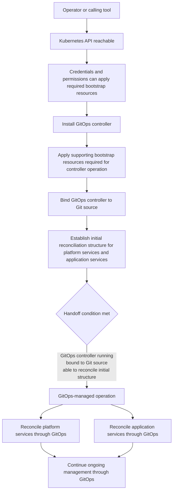

# Bootstrap installation contract

This document defines the contract for Kubecrate bootstrap installation. It explains what `point at a cluster and install` means from the operator point of view and where bootstrap installation hands off to GitOps-managed operation.

## Point at a cluster and install

`point at a cluster and install` is the target operator experience. The operator or a calling tool provides access to a Kubernetes cluster, and Kubecrate establishes the components required to start GitOps-managed operation.

The contract preserves the two-axis model:

- **lifecycle phase**: bootstrap installation or GitOps-managed operation
- **workload category**: platform services or application services

Bootstrap installation is a lifecycle phase, not a third workload category.

## Bootstrap installation start boundary

Bootstrap installation starts after:

- a Kubernetes API is reachable,
- the operator or calling tool has credentials and permissions to create or update the resources required for bootstrap installation, and
- any pre-existing resources that bootstrap installation will own do not conflict with those bootstrap-owned resources.

Bootstrap installation does not require a fresh or new cluster by default. It can start on any cluster that meets these prerequisites.

Cluster creation is outside the bootstrap installation boundary.

## Bootstrap installation completion and GitOps handoff

Bootstrap installation is complete when:

- a GitOps controller is running in the cluster,
- the controller is bound to a Git source, and
- the GitOps controller can reconcile an established initial structure for platform services and application services.

This is the handoff condition into GitOps-managed operation.

Bootstrap installation may include the GitOps controller and supporting bootstrap resources required to reach that handoff condition. It does not require final platform service selection before handoff. After handoff, platform services and application services are managed through GitOps unless a later decision documents a bootstrap-managed exception.

## Operator inputs

The operator or calling tool provides three conceptual input categories:

1. **Kubernetes access**: a reachable API and credentials with permissions that allow bootstrap installation.
2. **GitOps source information**: a reference to a Git repository that the GitOps controller will reconcile, including any access credentials required.
3. **Secret trust material**: any credentials or trust material required by secret-handling platform services are supplied by the operator for now.

These inputs are tool-neutral. The contract does not require a kind-specific, Terraform-specific, Ansible-specific, or bespoke Kubecrate interface.

## GitOps source structure roles

After bootstrap installation hands off to GitOps-managed operation, the GitOps source must support a small set of conceptual roles. These are roles, not final repository paths or directory names.

| Role | Purpose |
| --- | --- |
| **GitOps entrypoint** | The reconciled entrypoint that defines what the controller starts from. In Flux terms this may look like a root Kustomization chain. In Argo CD terms it may look like an App of Apps or another declarative entrypoint. |
| **platform services** | Definitions for shared platform capabilities such as ingress, certificate management, observability, policy, and supporting resources used by the GitOps controller. |
| **application services** | Definitions for the workloads that run on the platform. |
| **cluster or environment binding** | Configuration that binds shared definitions to a target cluster or environment, such as destination settings, overlays, values, or similar controller-specific binding data. |
| **ordering and ownership boundaries** | A way to keep reconciliation order and responsibility understandable, especially between platform services, application services, and cluster-specific binding concerns. |

Common patterns already exist across controllers. Flux documentation often shows roles that resemble infrastructure, apps, and cluster directories, sometimes with environment directories such as production or staging. Argo CD commonly expresses similar roles through Applications, AppProjects, destinations, and declarative parent-child entrypoints. Kubecrate should stay compatible with those patterns without locking the contract to a single repository layout.

## Contract decisions and deferred decisions

| Topic | Status | Contract position |
| --- | --- | --- |
| Bootstrap packaging compatibility | Deferred decision | Bootstrap packaging should stay consumable by common Kubernetes automation tools without a Kubecrate-specific interface. Helm is the current preferred candidate because it is widely compatible, but the contract does not require Helm or any specific packaging format. |
| GitOps source directory names and repository boundaries | Deferred decision | The contract defines conceptual roles only. Final directory names, repository boundaries, and controller-specific object mapping are intentionally left open. |
| Platform service selection after handoff | Deferred decision | The contract defines where platform services fit. It does not define the final set of platform services beyond bootstrap-supporting resources required for handoff. |

## Non-goals

This bootstrap installation contract explicitly excludes:

- **Cluster creation**. Bootstrap installation starts with a reachable Kubernetes API. Cluster creation tools and workflows are outside this contract.
- **Runnable manifests**. This document defines the contract. Kubernetes manifests, Helm charts, and other runnable artifacts are outside this document.
- **Installation scripts**. The contract is tool-neutral. Specific scripts, commands, or CLI interfaces are out of scope.
- **Final repository paths**. The GitOps source structure roles are conceptual. Final directory layout decisions, including how environments are represented, are outside this document.
- **Final platform service selection**. The contract defines where platform services fit. It does not define the complete set of platform services installed after handoff.

## Lifecycle diagram

The following diagram is illustrative only. It shows the lifecycle boundaries and handoff condition without defining runnable implementation.

The handoff does not require a separate `minimum platform services installed` stage. Bootstrap installation establishes GitOps-managed operation and any supporting bootstrap resources required for that handoff. Additional platform services are selected and installed through GitOps-managed operation.
